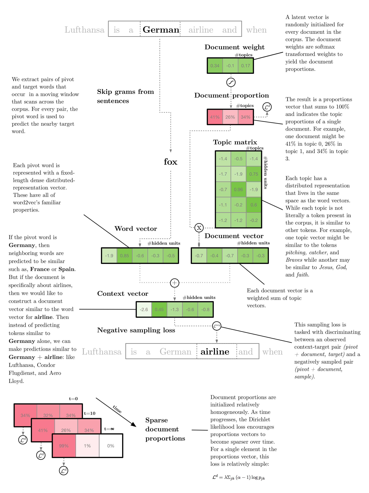
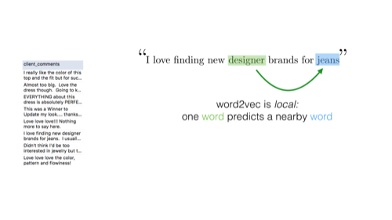
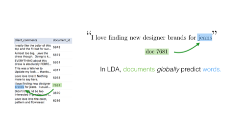
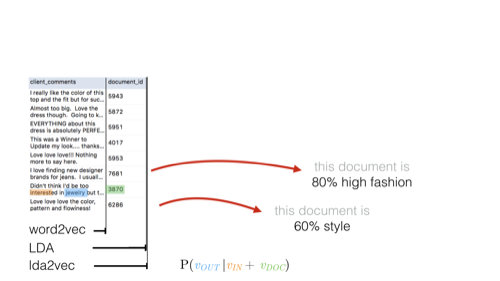
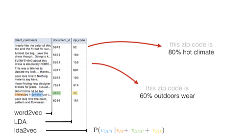
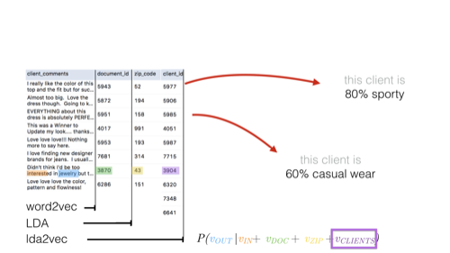
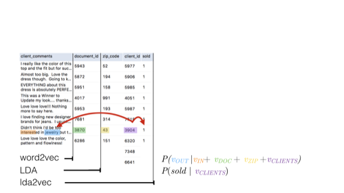
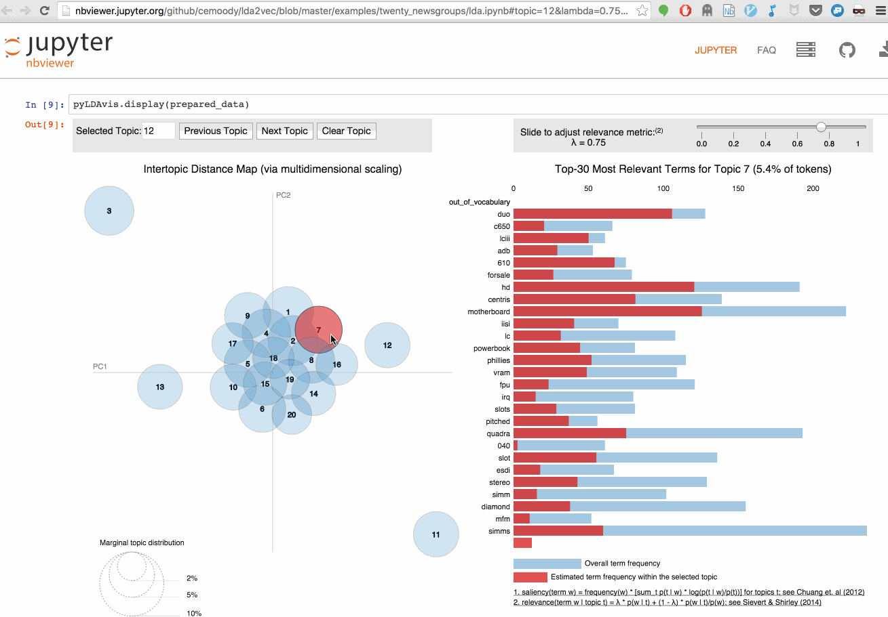

lda2vec: Tools for interpreting natural language
=================================================

.. image:: http://img.shields.io/badge/license-MIT-blue.svg?style=flat
    :target: https://github.com/cemoody/lda2vec/blob/master/LICENSE

.. image:: https://readthedocs.org/projects/lda2vec/badge/?version=latest
    :target: http://lda2vec.readthedocs.org/en/latest/?badge=latest

.. image:: https://travis-ci.org/cemoody/lda2vec.svg?branch=master
    :target: https://travis-ci.org/cemoody/lda2vec

.. image:: https://img.shields.io/badge/coverage-93%25-green.svg
    :target: https://travis-ci.org/cemoody/lda2vec

.. image:: https://img.shields.io/twitter/follow/chrisemoody.svg?style=social
    :target: https://twitter.com/intent/follow?screen_name=chrisemoody

The lda2vec model tries to mix the best parts of word2vec and LDA
into a single framework. word2vec captures powerful relationships 
between words, but the resulting vectors are largely uninterpretable
and don't represent documents. LDA on the other hand is quite
interpretable by humans, but doesn't model local word relationships
like word2vec. We build a model that builds both word and document
topics, makes them interpreable,  makes topics over clients, times,
and documents, and makes them supervised topics.

*Warning*: this code is a big series of experiments. It's research software,
and we've tried to make it simple to modify lda2vec and to play around with
your own custom topic models. However, it's still research software.
I wouldn't run this in production, Windows, and I'd only use it after you've
decided both word2vec and LDA are inadequate and you'd like to tinker with your
own cool models :) That said, I don't want to discourage experimentation:
there's some limited documentation, a modicum of unit tests, and some 
interactive examples to get you started.

Resources
---------
See the research paper `Mixing Dirichlet Topic Models and Word Embeddings to Make lda2vec <http://arxiv.org/abs/1605.02019>`_

See this `Jupyter Notebook <http://nbviewer.jupyter.org/github/cemoody/lda2vec/blob/master/examples/twenty_newsgroups/lda2vec/lda2vec.ipynb>`_
for an example of an end-to-end demonstration.

See this `slide deck <http://www.slideshare.net/ChristopherMoody3/word2vec-lda-and-introducing-a-new-hybrid-algorithm-lda2vec-57135994>`_
or this `youtube video <https://www.youtube.com/watch?v=eHcBeVnAiD4>`_
for a presentation focused on the benefits of word2vec, LDA, and lda2vec.

See the `API reference docs <https://lda2vec.readthedocs.org/en/latest/>`_

About
-----

Word2vec tries to model word-to-word relationships.

LDA models document-to-word relationships.

LDA yields topics over each document.

lda2vec yields topics not over just documents, but also regions.

lda2vec also yields topics over clients.

lda2vec the topics can be 'supervised' and forced to predict another target.

lda2vec also includes more contexts and features than LDA. LDA dictates that
words are generated by a document vector; but we might have all kinds of
'side-information' that should influence our topics. For example, a single
client comment is about a particular item ID, written at a particular time
and in a particular region. In this case, lda2vec gives you topics over all
items (separating jeans from shirts, for example) times (winter versus summer)
regions (desert versus coastal) and clients (sporty vs professional attire).

Ultimately, the topics are interpreted using the excellent pyLDAvis library:

Requirements
------------

Minimum requirements:

- Python 2.7+
- NumPy 1.10+
- Chainer 1.5.1+
- spaCy 0.99+

Requirements for some features:

- CUDA support
- Testing utilities: py.test
